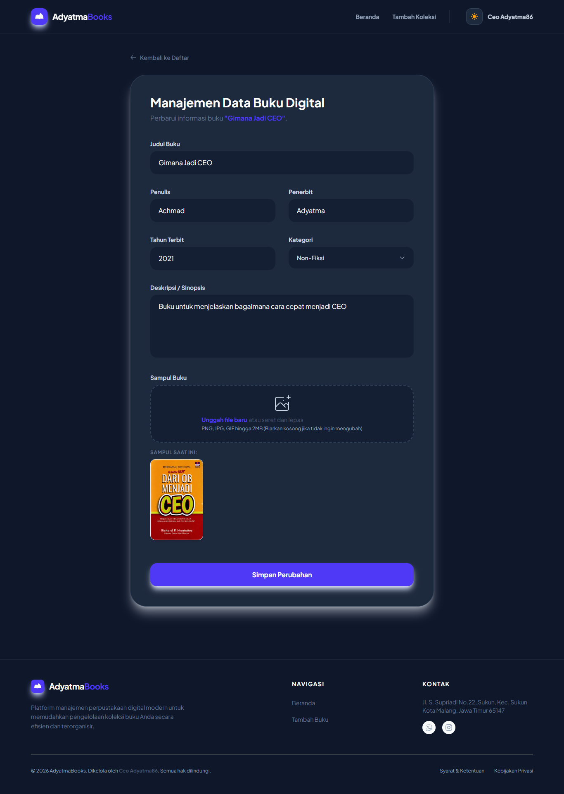

# Tampilan Halaman Utama

    

# LK-09
Nama: Achmad Helmy Aziz Adyatma
Nim: 24102001
Matkul: Pemograman Web
Dosen Pengampu:  
Link Demo: https://bukudigital.dyt.my.id/buku

## Cara Instalasi
1. Clone repository ini: `git clone https://github.com/adyatmaa86/LK-09.git`
2. Masuk ke folder project: `cd LK-09`
3. Install dependency PHP: `composer install`
4. Install dependency NPM: `npm install -D tailwindcss postcss autoprefixer`
5. Lalu jalankan perintah: `npm run build`
6. Ganti nama file .env.example menjadi .env
7. Generate App Key: `php artisan key:generate`
8. Sesuaikan setting database di file `.env`
9. Jalankan migrasi: `php artisan migrate`
10. Jalankan storage link: `php artisan storage:link`
11. Jalankan server: `php artisan serve`
12. Jalankan server npm: `npm run dev` 

## Preview Aplikasi

### Halaman Tambah Buku

### Halaman Edit Buku

### Halaman Detail Buku

